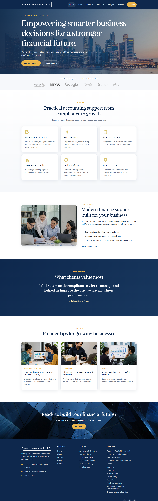
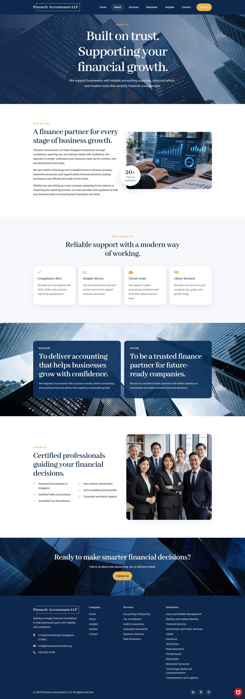
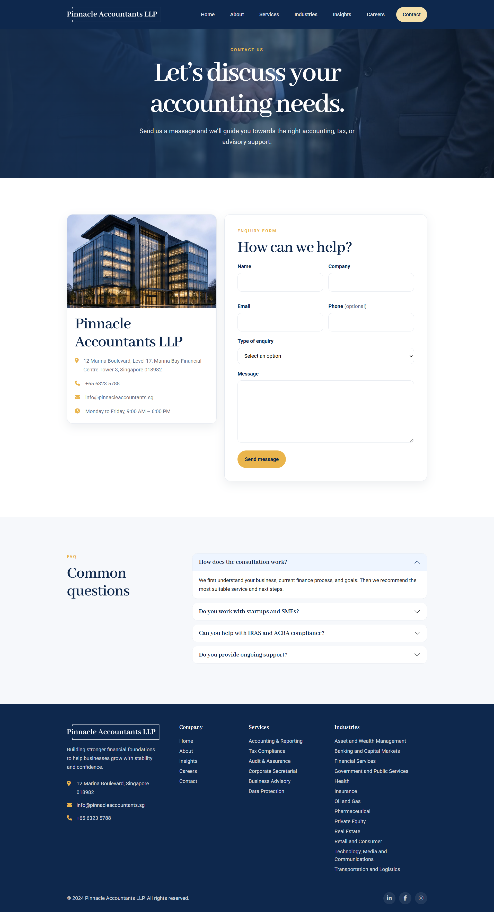

# 📊 Pinnacle Accountants — Corporate Website

A responsive multi-page corporate website frontend prototype for a fictional accounting firm, designed with a clear content structure, consistent visual design, and responsive user experience.

## 🌐 Live Demo

🔗 View app: https://pinnacle-accountants-rushdina.vercel.app/

<table align="center">
  <tr>
    <td align="center" valign="top">
      <em>Homepage</em><br/>
      
    </td>
    <td align="center" valign="top">
      <em>About Page</em><br/>
       
    </td>
    <td align="center" valign="top">
      <em>Contact Page</em><br/>
       
    </td>
  </tr>
</table>

## Overview

Pinnacle Accountants is a corporate website frontend prototype designed to present the services, expertise, and company information of a fictional Singapore accounting firm.

The project focuses on **frontend design and development**, combining structured content, responsive layouts, reusable styling, and interactive interface components across three fully developed pages: **Home, About, and Contact**.

The website is built using **HTML5, CSS3, JavaScript, and Bootstrap 5**, with semantic HTML, accessibility considerations, and on-page SEO practices incorporated throughout the implementation.

As a frontend prototype, the project demonstrates the website's interface, layout, content structure, responsiveness, and user experience. Backend functionality and service integrations are outside the scope of the project.

## 🛠️ Technologies Used

- **HTML5** — semantic page structure and content
- **CSS3** — custom styling, responsive layouts, animations, and visual design
- **JavaScript** — navbar scroll behaviour and interactive component configuration
- **Bootstrap 5** — responsive grid system, navigation, carousel, accordion, and UI utilities

## Pages

### Home

Introduces the company and its services through:

- Hero section and calls to action
- Client logo section
- Accounting and advisory services
- Company value proposition
- Client testimonials
- Financial insights
- Contact call to action

### About

Provides information about the company through:

- Company introduction
- Business approach and use of modern technology
- Core values
- Mission and vision
- Professional expertise and certifications
- Contact call to action

### Contact

Provides a structured contact experience with:

- Company contact information
- Enquiry form interface
- Type-of-enquiry selection
- Frequently Asked Questions (FAQ) accordion

The enquiry form is implemented as a frontend interface only and is not connected to a backend service.

## Frontend Development

The website uses a combination of **Bootstrap and custom CSS** to create reusable and responsive page layouts.

Custom frontend implementation includes:

- CSS Grid and Flexbox layouts
- Responsive Bootstrap grid layouts
- Reusable CSS variables for colours, spacing, shadows, and border radius
- Responsive typography using `clamp()`
- Reusable cards, buttons, sections, and content patterns
- Responsive images and image aspect ratios
- Hover states and transitions
- Fixed responsive navigation
- Mobile navigation menu
- Responsive layout adjustments using media queries

## Responsive Design

The website is designed to adapt across desktop, tablet, and mobile screen sizes.

Responsive behaviour includes:

- Collapsible navigation on smaller screens
- Multi-column grids that adapt to fewer columns as screen width decreases
- Single-column layouts on mobile devices
- Responsive typography and section spacing
- Flexible hero and call-to-action layouts
- Responsive forms, cards, images, and footer content

## Interactions

JavaScript and Bootstrap provide lightweight frontend interactions, including:

- Navbar styling changes when the page is scrolled
- Automatic testimonial carousel
- Carousel navigation controls
- Pause-on-hover testimonial behaviour
- Responsive navigation toggle
- Expandable FAQ accordion
- Smooth scrolling for page sections

## Accessibility

Accessibility considerations include:

- Semantic HTML elements
- Structured heading hierarchy
- Descriptive image alternative text
- Decorative images hidden from assistive technologies where appropriate
- ARIA labels and attributes for navigation and interactive elements
- Associated form labels
- Appropriate input types
- Required form fields
- Form autocomplete attributes
- Keyboard-accessible Bootstrap components

## SEO

Basic on-page SEO practices include:

- Page-specific `<title>` elements
- Page-specific meta descriptions
- Semantic HTML structure
- Structured heading hierarchy
- Descriptive page content
- Image alternative text
- Mobile-responsive layouts

## 📁 Project Structure

```text
pinnacle-accountants-corporate-website/
├── images/
├── index.html
├── about.html
├── contact.html
├── style.css
└── script.js
```

## ▶️ Running the Project

No installation or build process is required.

1. Clone or download the repository.
2. Open the project folder.
3. Open `index.html` in a web browser.

For local development, the project can also be run using a local development server such as the VS Code Live Server extension.

## Project Scope

This project was developed as a **frontend prototype** to demonstrate corporate website design and frontend development. It focuses on the visual interface, responsive behaviour, content architecture, accessibility, and user experience.

Features requiring backend services, such as processing and storing contact form submissions, authentication, content management, and other server-side functionality, are not implemented.

## 🧠 Challenges & Solutions

### 1. Responsive Multi-Page Layout

**Challenge:** Creating varied page layouts that remain consistent and usable across desktop, tablet, and mobile screen sizes.

**Solution:** Used Bootstrap, CSS Grid, Flexbox, responsive sizing, and media queries to adapt layouts, navigation, typography, and content across different screen sizes.

### 2. Consistent Corporate Design System

**Challenge:** Maintaining a consistent visual identity across different pages, sections, and UI components.

**Solution:** Created reusable CSS styles and variables for colours, typography, spacing, buttons, cards, shadows, and other shared design elements.

### 3. Website Structure & Content

**Challenge:** Representing a complete corporate website while limiting the prototype to three fully developed pages.

**Solution:** Structured Home, About, and Contact as the main pages, while using navigation and homepage sections to represent the broader website sitemap and content hierarchy.

### 4. SEO & Accessibility

**Challenge:** Balancing the visual design with a semantic website structure that supports accessibility and search engine optimisation.

**Solution:** Applied semantic HTML, structured headings, page metadata, descriptive alt text, ARIA attributes, accessible navigation, and labelled form controls.

## 📚 Key Learnings

* Strengthened responsive web design skills by adapting layouts, navigation, typography, and content across different screen sizes.
* Improved understanding of CSS Grid, Flexbox, Bootstrap, and media queries for building flexible multi-page layouts.
* Learned to create and maintain a consistent design system using reusable CSS styles, variables, typography, colours, and UI components.
* Improved skills in structuring website content and navigation to establish a clear information hierarchy.
* Applied semantic HTML and accessibility practices, including structured headings, alt text, ARIA attributes, and labelled form controls.
* Improved understanding of on-page SEO through page titles, meta descriptions, semantic structure, and organised web content.

## ⚠️ Disclaimer

This is a fictional project created for demonstration and portfolio purposes. Pinnacle Accountants LLP, its company information, testimonials, statistics, client relationships, and other business details presented on the website are fictional or used as demonstration content.
